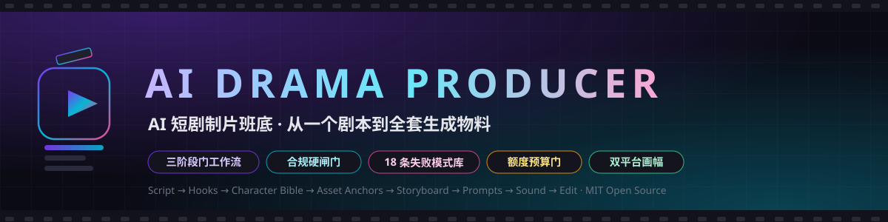
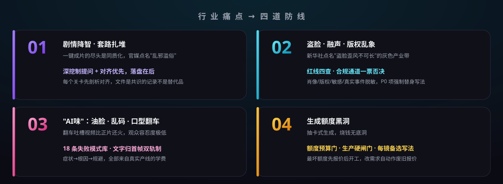
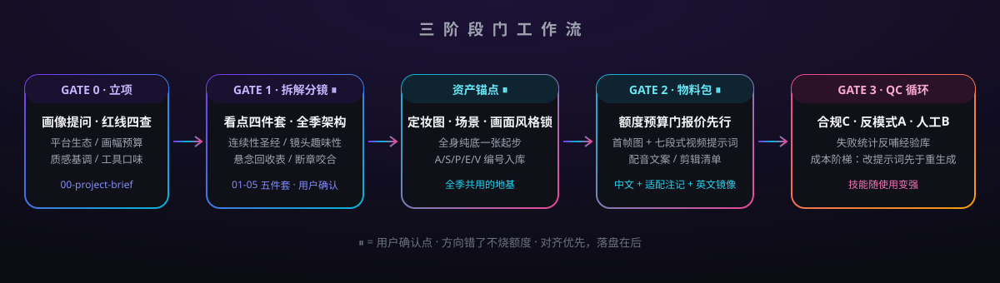

<div align="center">




**把一个剧本，变成可直接拿去生成的全套 AI 短剧物料。**

剧本拆解 · 看点设计 · 角色一致性档案 · 资产图锚点 · 分镜表 · 逐镜首帧提示词 · 七段式视频提示词 · AI 配音方案 · 剪辑清单

[快速开始](#-快速开始) · [工作流](#-工作流三阶段门) · [四道防线](#-四道防线) · [示例](#-示例) · [English below](#what-is-this)

</div>

---

## 🎬 它是什么

一个装在 agent 里的**制片班底**：你是制片人，它按影视工业前期流程干活——每个关卡先对齐再产出，每条提示词过三通道审查（合规 / 反模式 / 人工清单），每一分生成额度都有预算门。

不是"一键成片"的竞品。一键成片的尽头是模板化同质化；这里走的是**导演指挥 AI 班底**的路线。

## 🛡 四道防线



## 🚀 快速开始

把本目录放进 agent 技能目录（如 `~/.agents/skills/ai-drama-producer/`），然后丢给 agent 一句话：

```text
这是我的剧本（粘贴/给路径），出AI短剧物料
```

或只说需求：`分析这张图的风格`（风格反推）、`这个镜头人物很油怎么办`（QC 修复）。

> **触发与兜底**：agent 技能自动触发实测约五成可靠性。要稳定命中，用显式调用
> `/skill ai-drama-producer <需求>`，或在消息里直接点名本技能。

## 🔄 工作流（三阶段门）



<details>
<summary><b>每个阶段产出什么？（点击展开）</b></summary>

| 阶段 | 产出物 |
|---|---|
| **Gate 0 立项** | `00-project-brief.md`（画像提问 + **红线四查**：肖像/版权/敏感/真实事件脱敏） |
| **Gate 1 拆解分镜** | `01` 剧本拆解 · `02` 看点四件套+悬念账本 · `03` 连续性圣经（身份不变式+语言指纹）· `04` 分镜表（含**备选列**与**衔接列**）· `05` 全季架构（悬念回收表） |
| **资产锚点** | 每角色 1 张全身纯底定妆图（防丑验收四条）+ 场景/道具锚点 + **画面风格锁** |
| **Gate 2 物料包** | 逐镜首帧图提示词（**文字归首帧**）· 七段式视频提示词（模型无关核心+适配注记+英文镜像）· 配音文案（节拍对齐）· 剪映口径剪辑清单 |
| **Gate 3 QC** | 三通道审查 → 成本阶梯修复 → 失败写回经验库（技能越用越强） |

</details>

## 📦 项目级校验

```bash
python scripts/install.py --check                                # 包完整性
python scripts/validate_project.py <项目目录> --gate 1            # 拆解阶段：五件套+红线+分镜表完整性
python scripts/validate_project.py <项目目录> --gate 2 --multi   # 物料阶段：追加锚点/提示词/声音/剪辑/QC
```

## 🧪 示例

| 示例 | 题材 | 演示重点 |
|---|---|---|
| [《深夜面馆》5 镜](examples/worked-mini-example.md) | 家庭情感 | 全流程产物形态：红线清单→七段式→英文镜像→三通道标记 |
| [《画中郎》3 镜](examples/hook-loop-mini-example.md) | 古装悬疑 | **开场钩机制库**组合 + **循环播放**断章设计 + 声音节拍对齐 |

## 🧭 设计原则

1. **对齐优先，落盘在后**——写完就可能因意见分歧被重写的文件，写早了
2. **平台无关**——"模型无关核心 + 适配注记 + 英文镜像"三件套，不在任何单一平台押注
3. **经验可沉淀**——QC 新坑写回失败模式库，并定期修剪；技能随使用变强
4. **零硬依赖**——本机有反模式引擎/导演类技能则借用，没有则内置人工清单兜底
5. **个人偏好不内置**——预算/画幅/工具口味 Gate 0 现场问、按项目存档

<details>
<summary><b>目录结构</b></summary>

```
SKILL.md                    管线主文件（三阶段门 + 提问协议 + 对齐原则）
assets/                     题库 / 平台适配 / 资产锚点 / 短剧节奏 / 镜头趣味性
                            失败模式库 / 风格反推 / 物料模板 / QC 循环
examples/                   两个迷你金样
scripts/                    install.py / validate_project.py
docs/img/                   视觉资产（SVG，仓库内自托管）
```

</details>

## ✅ 适用与不适用

| ✅ | ❌ |
|---|---|
| AI 短剧 / 微短剧 / 竖屏剧情片全部前期物料 | 剧本续写打磨（交给剧本类技能，从成稿开始） |
| 画面风格反推（参考图 → 风格锁） | 替代剪辑软件（只出剪辑清单） |
| 生成失败的症状诊断与修复 | 替代生成平台本身 |

## ⚖️ 合规承诺

生成前强制过**肖像权 / 版权 / 内容敏感 / 真实事件脱敏**四查（P0 一票否决），红线源头登记在项目档案。不生成真实人物肖像内容，不处理受保护 IP 角色的直接还原。

## 🗺 维护

- 平台适配表口径复查：每 3 个月或主流模型大版本更新时（下次 **2026-12**）
- 失败模式库：QC 循环持续追加 + 定期修剪
- 版本历史见 [CHANGELOG.md](CHANGELOG.md) · 测试记录见 [TESTING.md](TESTING.md)

---

<div align="center">

**MIT License** · 欢迎提 Issue 与 PR，实战新坑按「症状→根因→规避」三段式入库并署名贡献

*Made with 🎬 by jiduge9-coder*

</div>

---

## What is this (English)

An **AI drama production crew** living inside your coding agent. Feed it a script; it runs a gated film-industry pipeline — script breakdown, hook design (4-piece formula + suspense ledger), character consistency bibles, asset anchor images (makeup shots / location / prop / style-lock), shot lists with fallback takes, per-shot first-frame image prompts (on-frame text rendering), 7-segment model-agnostic video prompts with platform adapters and English mirrors, AI voiceover scripts and a CapCut-grade edit plan. Four layers of QC, a compliance hard-gate (portrait/copyright/sensitive/real-event checks), and an 18-entry failure-mode library distilled from real production lines. MIT licensed.
